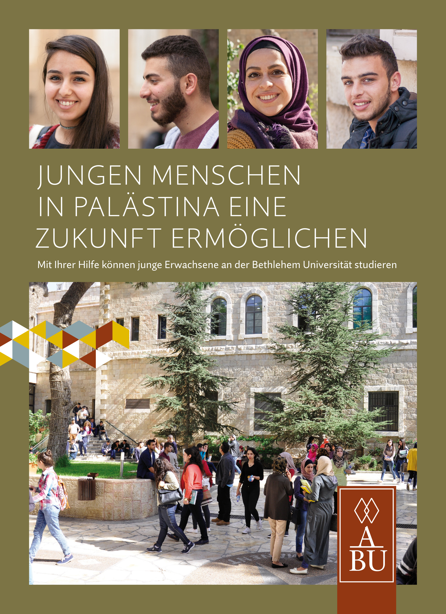
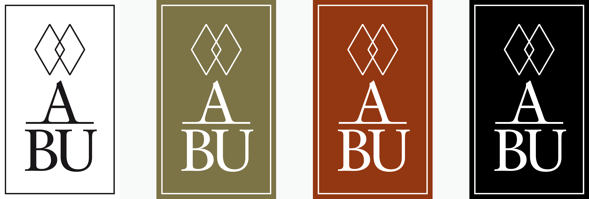
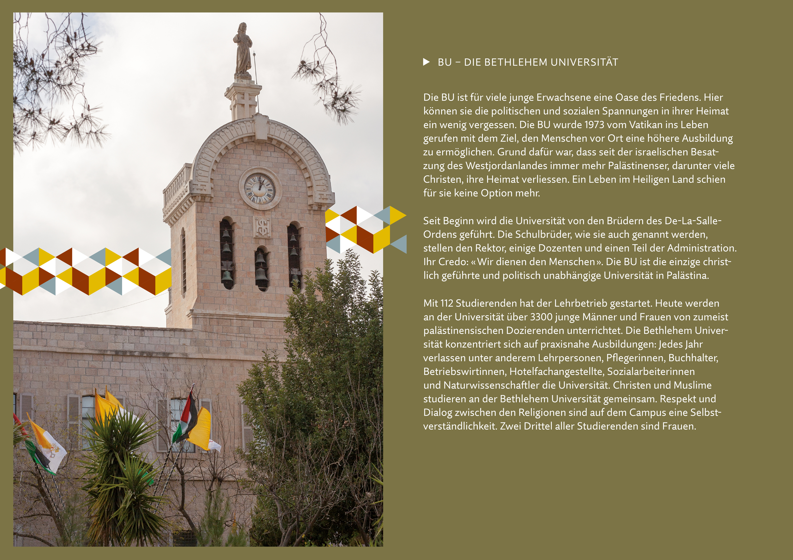
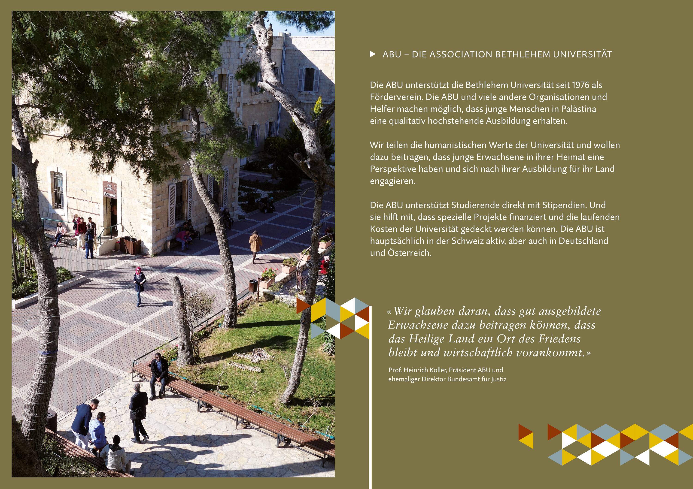
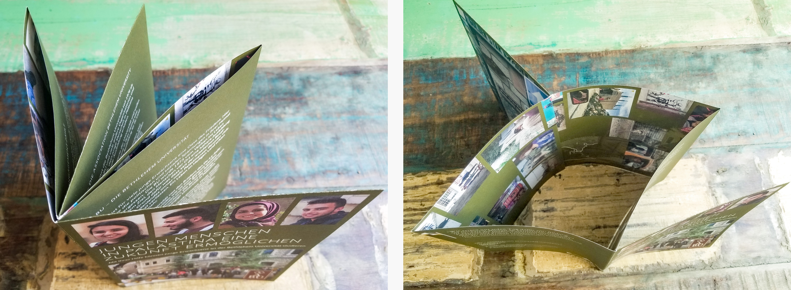
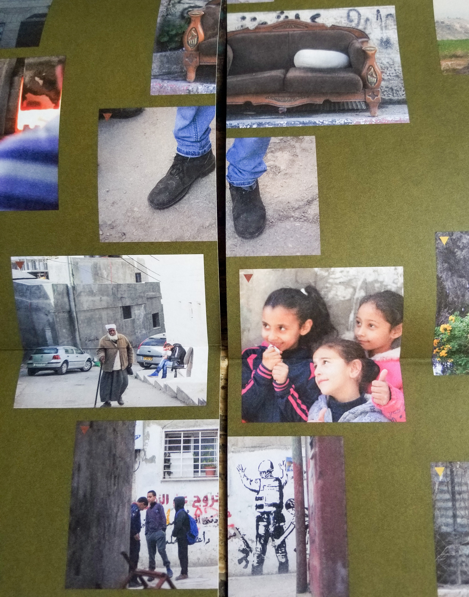

ABU (Association Bethlehem University) is a non-governmental organization that has been supporting Bethlehem University since 1976 to provide young people in Palestine with a high-quality education in a peaceful environment.

I was approached by the managing director, Erika Burri, to design the new identity as well as some print products for fundraising. It was a great opportunity to be involved in the project from the very start. Working closely with Erika, who was responsible for writing the content, I was able to co-conceptualize the products so that the content fit well with the design.

The logo can be used in different colors and features two intertwined diamonds, derived from the logo of Bethlehem University, which shows three triangles pointing upwards. The diamonds 'fill in the blanks' and stand metaphorically for partnership - with the university, between students, but also between the two countries of Israel and Palestine.

An eight-page brochure provides information about the foundation's activities and the impact of getting involved. The logo is playfully used as a colored ornament. The main colors, olive and burgundy, are inspired by the barren landscape reflected in the Palestinian flag.

Thanks to the special folding technique with center cut, the brochure contains a flipside poster that's only revealed when fully unfolded.

To get imagery for the poster, we carefully briefed three students and equipped them with cameras to document their daily 'way to education'.

The paths and images are partially cut, both in reality and on the poster.

