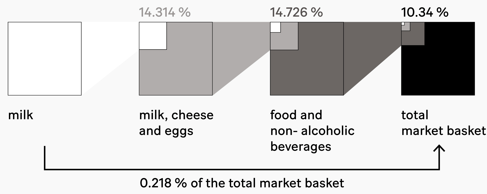
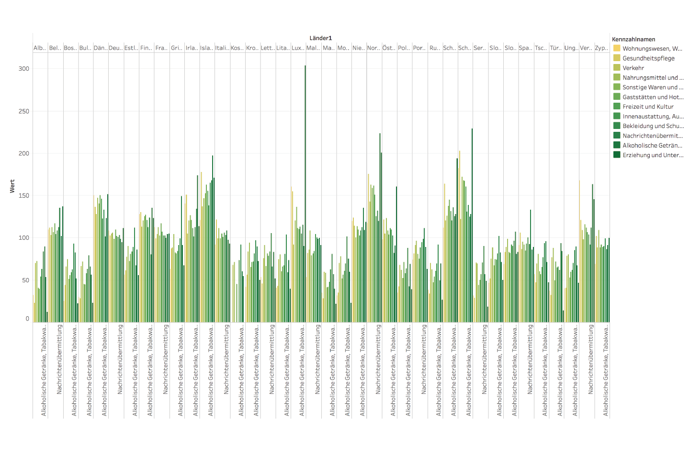
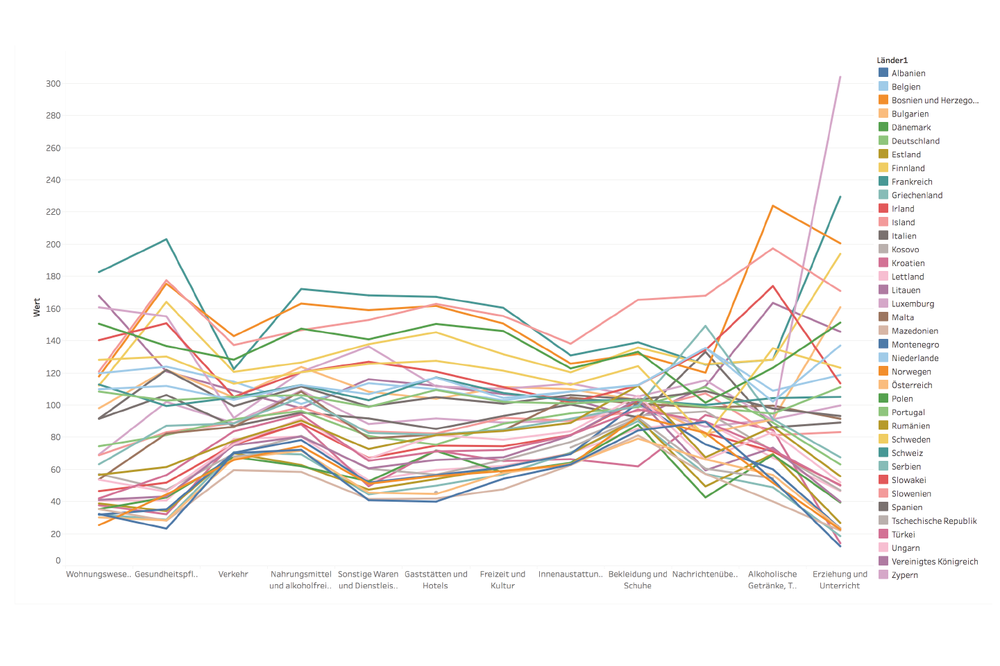
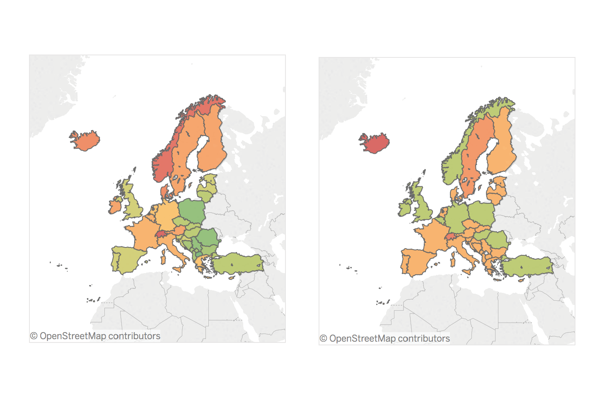
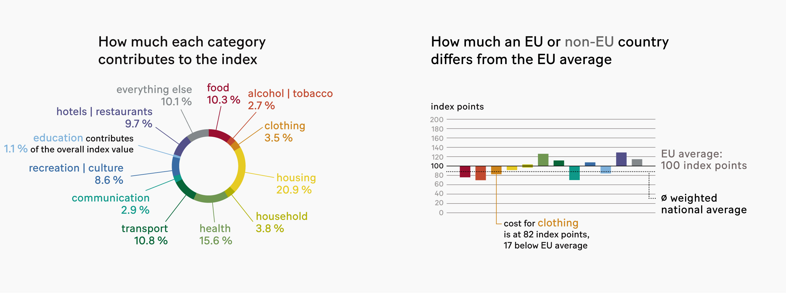
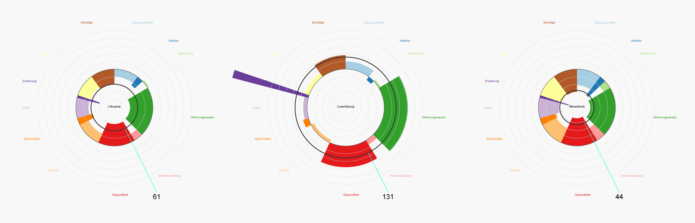

Working at [superdot](https://www.superdot.studio/), you often get the chance to dig through interesting datasets. We came across a dauntingly detailed [table](https://www.bfs.admin.ch/bfs/de/home/statistiken/preise/erhebungen/icp.assetdetail.12827262.html) based on the [Harmonized Index of Consumer Prices](https://en.wikipedia.org/wiki/Harmonised_Index_of_Consumer_Prices) (HICP). A cool topic for a summer lab project – read the full article on [Medium.](https://medium.com/superdot_studio/a-diagram-type-for-a-niche-data-use-case-56114a5e8abf)

Prices and earnings vary dramatically from region to region, even within the European Union. The Harmonized Index of Consumer Prices attempts to make sense of this. The prices of roughly 300,000 products are monitored throughout Europe, to understand the real cost of rice in Bulgaria, shoes in Luxembourg or a taxi ride in Sweden.

Milk is just one example for the all products monitored in the HICP basket.

First, we had to make sense of the data. [Tableau](https://www.tableau.com/) is great for rough and ready, explorative data analysis.

Outliers, such as the price for education in Luxembourg, are revealed.

Tendencies, like a wider variation in health than transport, become visible.

The split between north and south, east and west becomes obvious on a map.

After many sketches with pen and paper, a new diagram type emerged: a hybrid of a polar area chart and a pie chart, focusing on deviation from a group mean. With this diagram type, we can show the price for each category with the radial distance from the mean, as well as the weighting of that category with the central angle. Slices pointing inward correspond to a below-average index value, and those pointing outward represent an above-average, or ‘expensive’, index value.

With a slightly unusual but fruitful workflow, I generated the SVG structure of the diagrams in JavaScript with [D3](https://d3js.org/), before exporting to Adobe Illustrator for proper styling. The final output is a poster which gives a detailed overview over the cost of living in European countries. Some notable insights are specially pointed out, but there are many more details to explore, so take your time …

