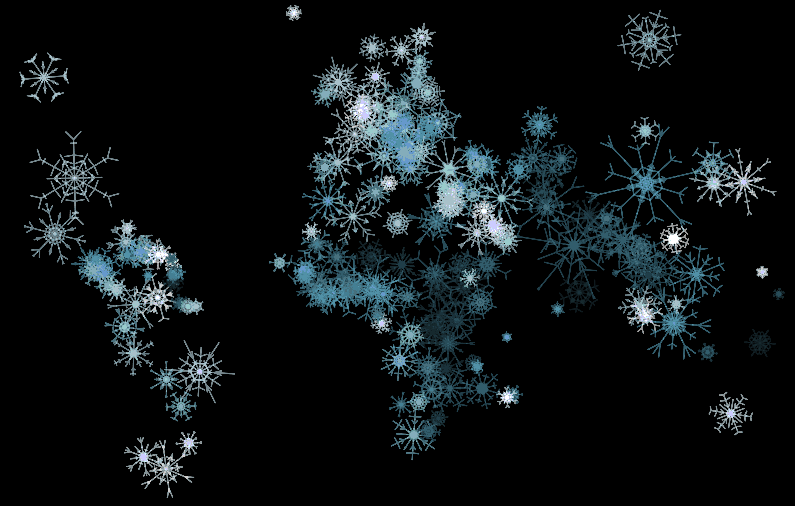

The [Singapore-ETH Centre](https://sec.ethz.ch/) comprises research programs that address the challenges of modern societies worldwide, in urban environments and beyond.

For the season's greetings card, I created a visual concept that connects the scientific theme with the festive occasion: each country is represented by a snowflake. The resulting world map is a visualisation of UN-data, scraped from <a href="https://www.worldometers.info/world-population/population-by-country/">Worldometers.</a> The population size corresponds to the size of the snowflake.

The infographic is coded in [D3](https://d3js.org/), snowflake logic by Sergio Ordóñez. Using random parameters for the snowflakes, every single one is unique.

Each year, different data is used. For the first edition, the hue is determined by the percentage of the urban population - the lighter the color, the more urban the country.

For the second edition, hue reflects population density – the lighter the color, the denser the country. And below an example with hue reflecting fertility rate, darker snowflakes represent less children.

