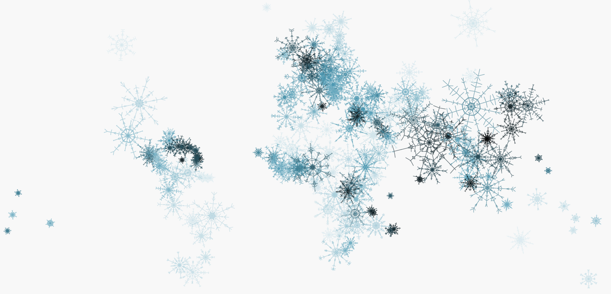
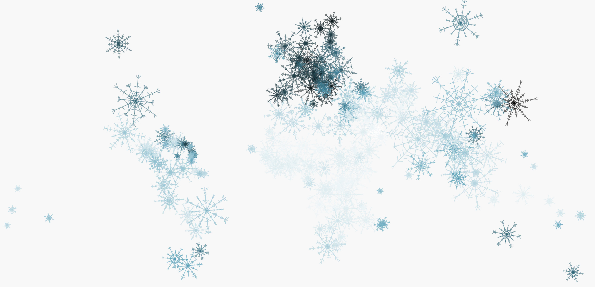

The [Singapore-ETH Centre](https://sec.ethz.ch/) comprises research programs that address the challenges of modern societies worldwide, in urban environments and beyond.

For the season's greetings card, I created a visual concept that connects the scientific theme with the festive occasion: each country is represented by a snowflake. The resulting world map is a visualisation of UN-data, scraped from <a href="https://www.worldometers.info/world-population/population-by-country/">Worldometers.</a> The population size corresponds to the size of the snowflake.

Each year, different data is used: for the first edition, the hue is determined by the percentage of the urban population - the darker the color, the more urban the country.

For the second edition, hue reflects population density – the darker the color, the denser the country. The infographic is coded in [D3](https://d3js.org/), with the kind help of Sergio Ordóñez for the snowflake logic.

Above is an example with hue reflecting fertility rate – with darker snowflakes representing more children. Using random parameters for the snowflakes, every single one is unique.

Data stories are told in every individual version, but also in comparison within the series. Below is a version with hue reflecting aging societies, with darker snowflakes representing a higher percentage of people above 60. It is almost the exact opposite of the fertility rate version.

