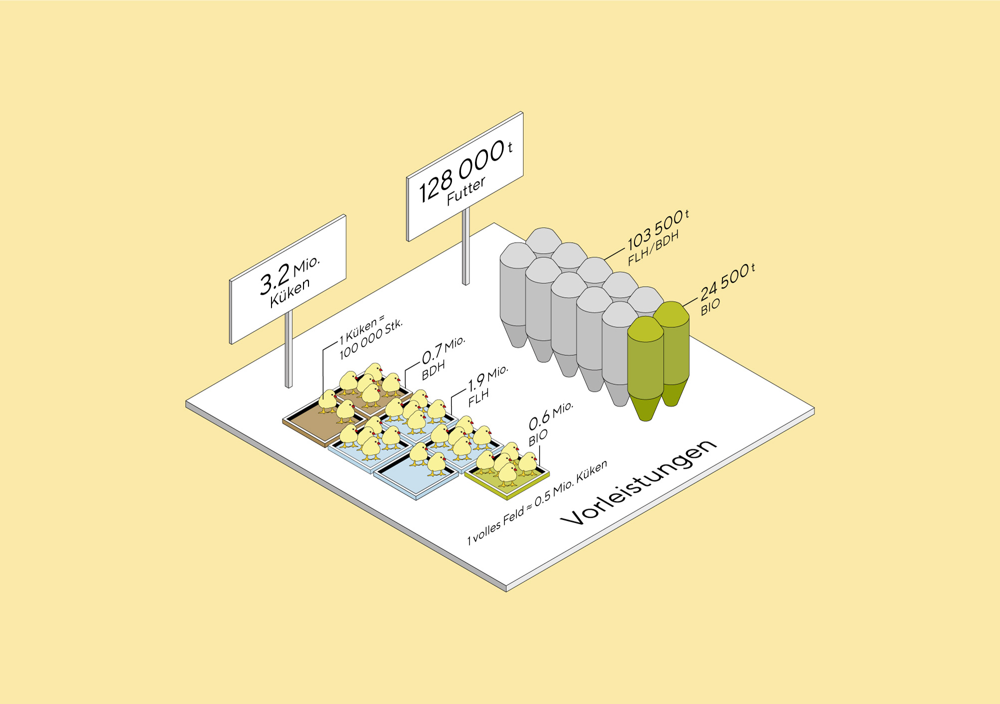
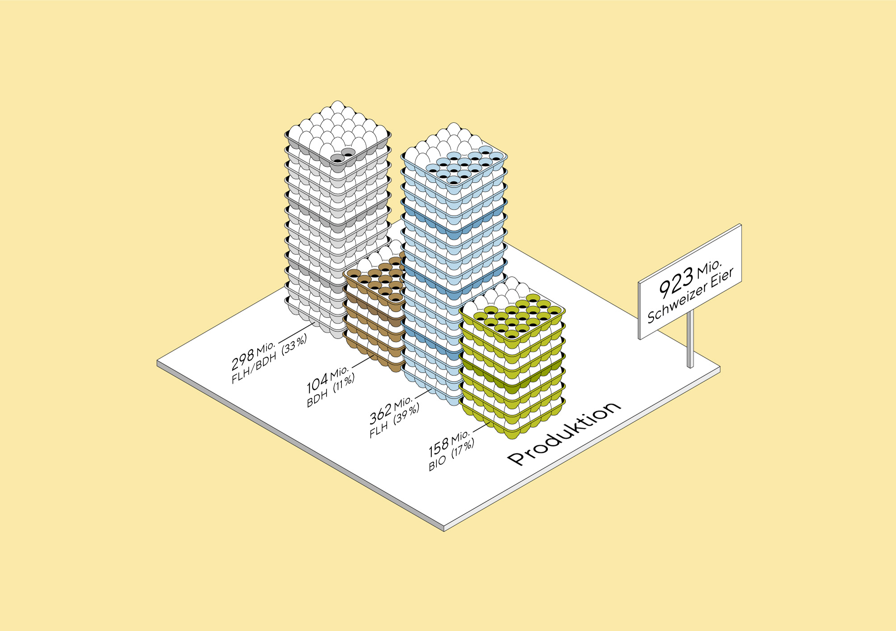
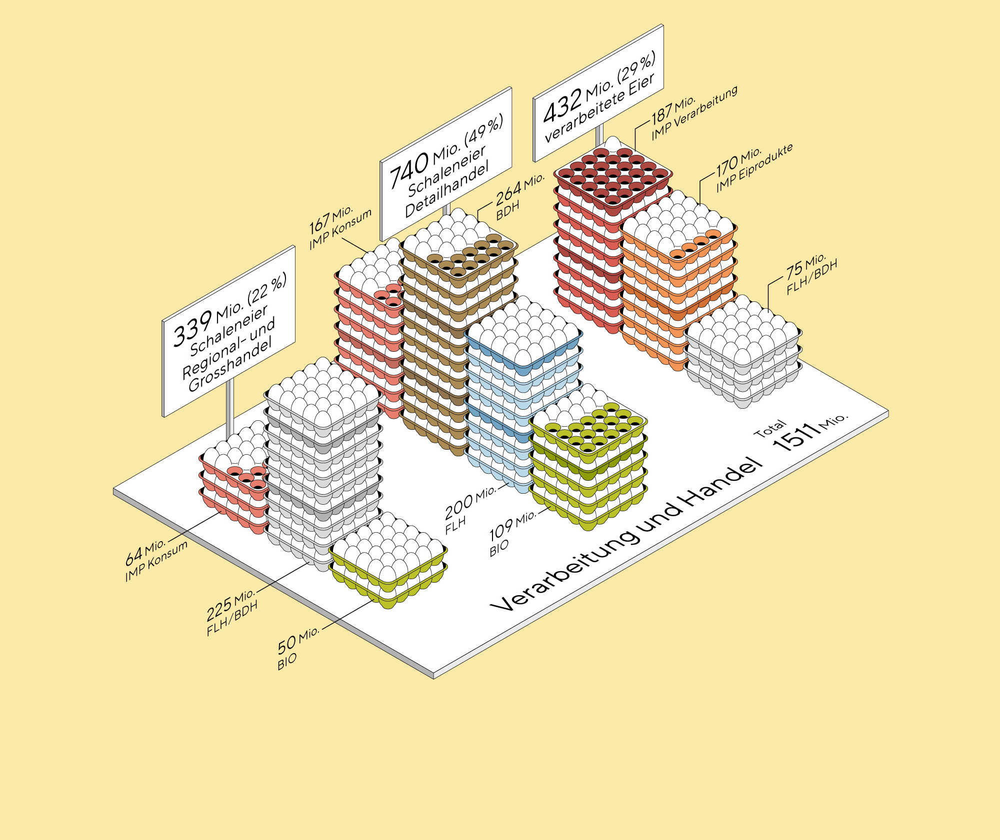
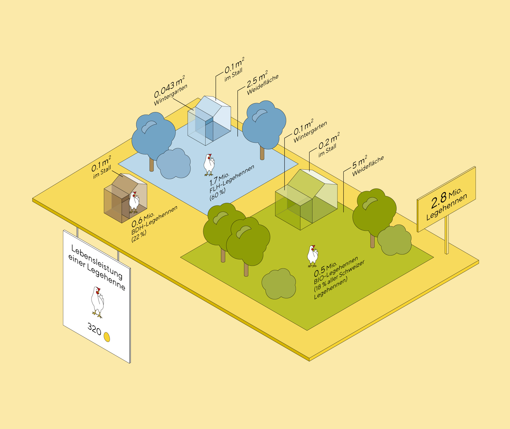
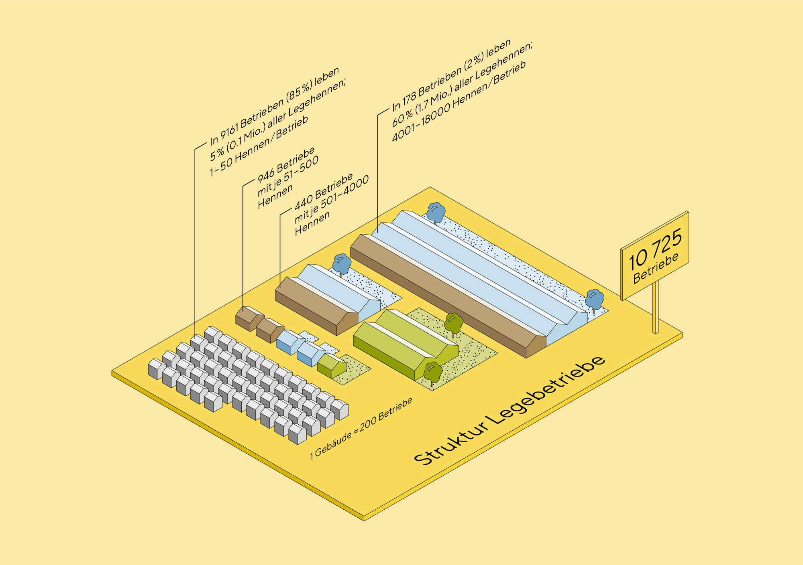
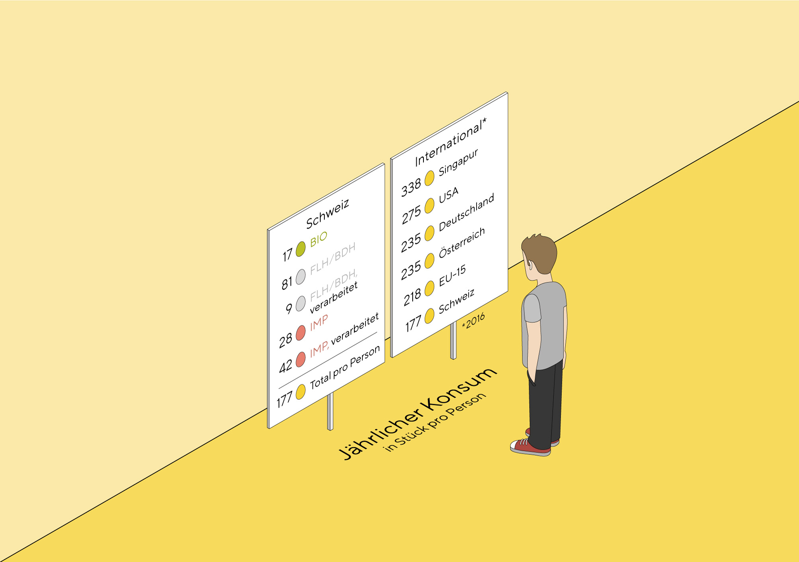
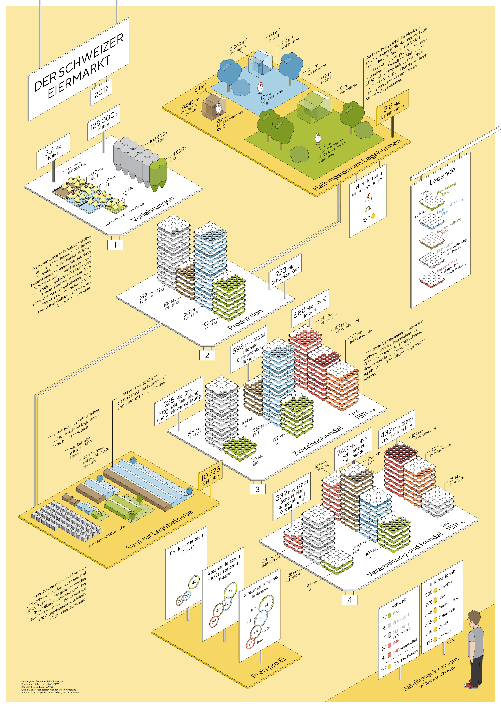

This project was created with the lovely folks from [superdot](https://www.superdot.studio/) who were approached by the department of Market Analysis of the Swiss Federal Office for Agriculture FOAG to map the Swiss egg market.

We were given a massive load of data to fiddle with and were relatively free about what to show. We designed an information poster, giving a general overview of the most important factors.

For the look and feel, we chose the isometric view as this allowed us to accurately display volumes and sizes in an understandable and attractive way.

The central part of the infographic, on white platforms, are the four steps of the value-added chain.

Colour was used as a code for the three domestic production methods ‘organic’, ‘free-range’, and ‘cage-free’ plus ‘import’.

On the yellow platforms, we draw different ‘side stories’ such as conditions for different production methods, distribution and size of breeding farms, and international comparison about egg consumption.

The poster was first published in 2017, and updated in the following years. It is available in the three national languages German, French and Italian.

