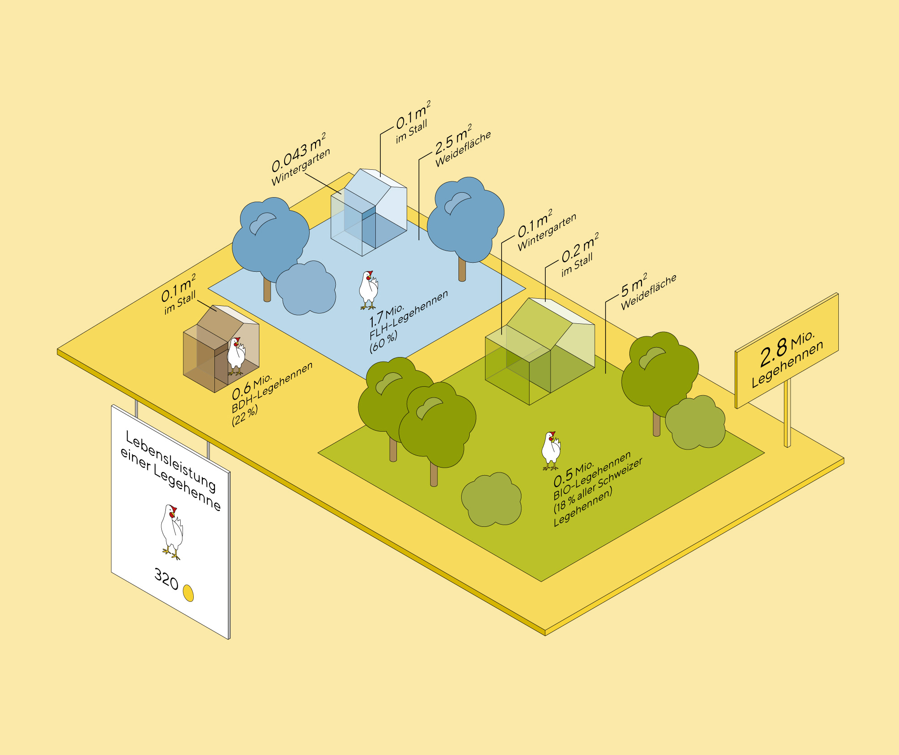
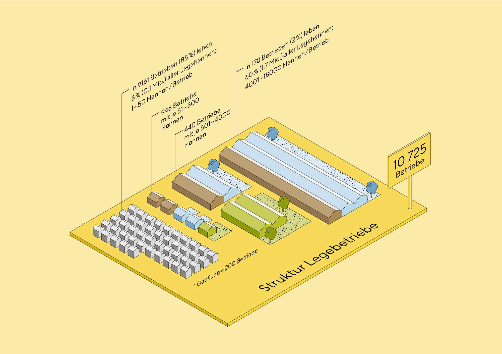
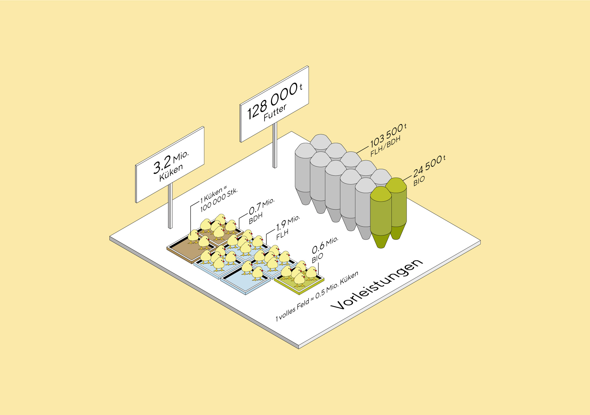
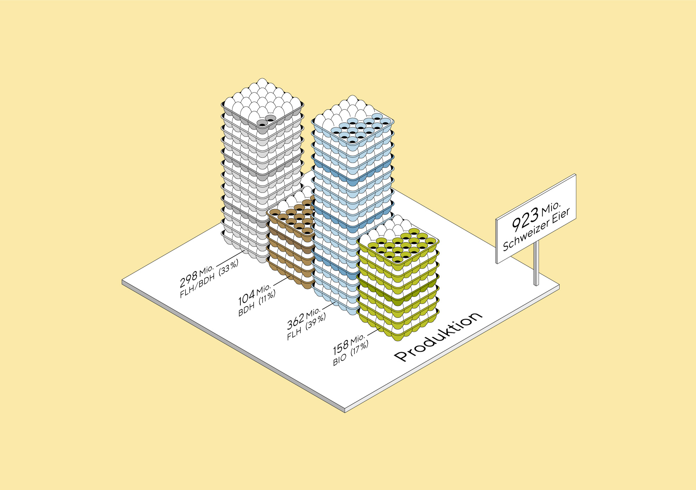
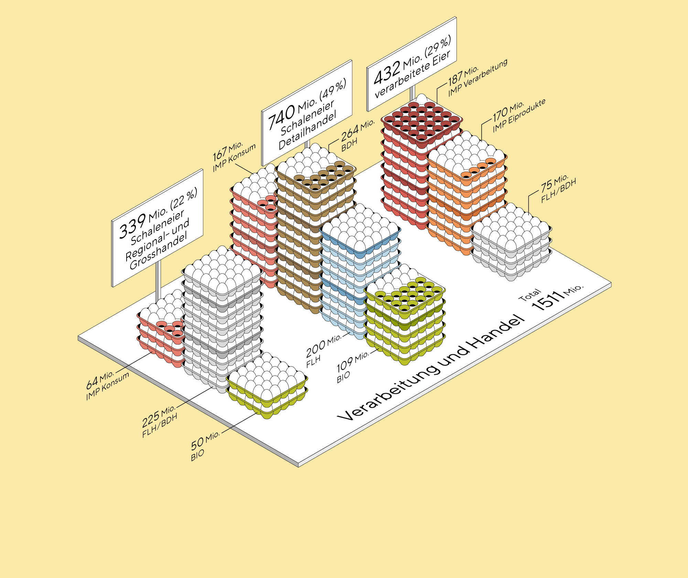
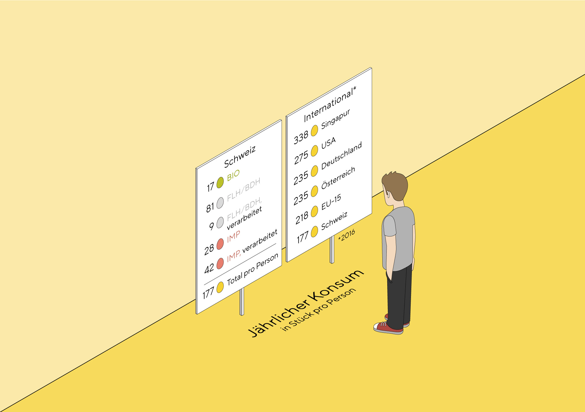
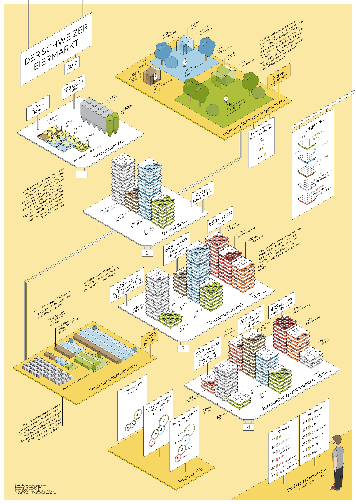

In 2017, the department of Market Analysis of the Swiss Federal Office for Agriculture FOAG approached [superdot](https://www.superdot.studio/) for a collaboration on a project about the egg market.

We were given a massive load of data to fiddle with and were relatively free about what to show. We designed an information poster, giving a general overview: the central part of the infographic are the four steps of the value-added chain (white platforms). From there we draw different ‘side stories’ such as conditions for different production methods, distribution and size of breeding farms, and international comparison about egg consumption. Colour was used as a code for the three domestic production methods ‘organic’, ‘free-range’, and ‘cage-free’ plus ‘import’.

For the look and feel, we chose the isometric view as this allowed us to accurately display volumes and sizes in an understandable and attractive way.

The poster was first published in 2017, and updated in the following years. It is available in the three national languages: German, French and Italian.

