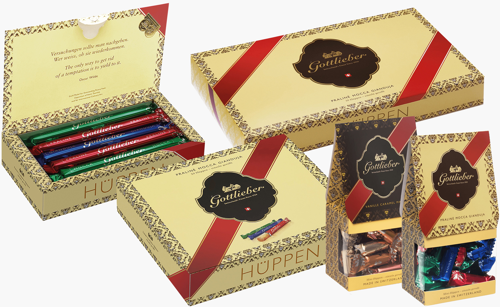
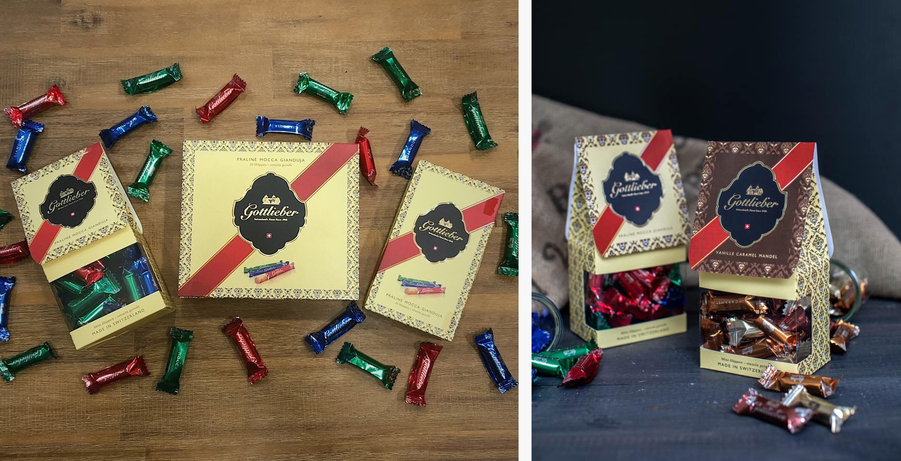
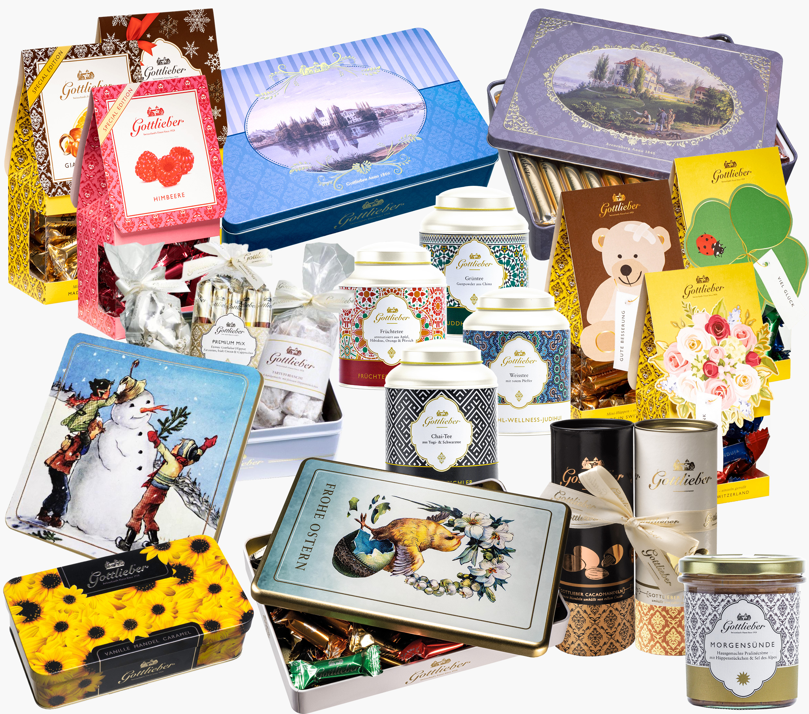
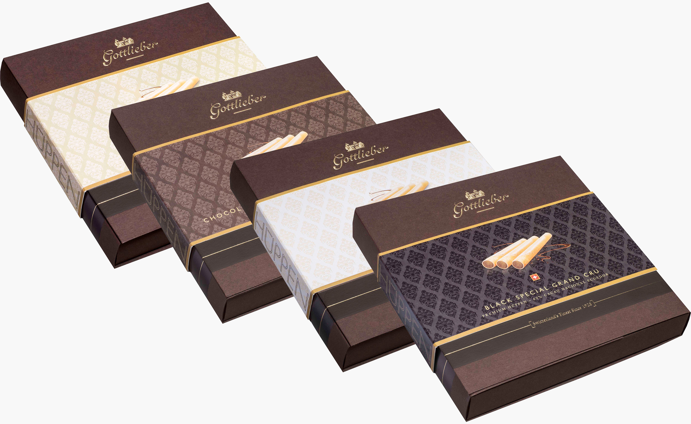

In 2014, I started working for [Gottlieber Spezialitäten AG](https://www.gottlieber.ch/en/), a traditional Swiss confectionery founded in 1928 which has been pleasing chocolate lovers ever since with their unique Hüppen, a rolled wafer with delicious creamy filling.

I have been responsible for the design of about 100 products, including the redesign of the signature <a href="#traditionLine">Tradition Line</a>, many decorative tin boxes and the upmarket <a href="#premiumLine">Premium Line.</a>

It's been very rewarding to collaborate with a client over such a long time. While I grew from novice to packaging design expert, I could witness a comparatively small business develop into a company with six cafés and salespoints in Europe and Asia.

In 2020, the <strong>Tradition Line</strong> was completely revamped. While some elements (light yellow background, red ribbon) remained, a lot of details were adjusted and modernised. The logo is embossed in gold foil.

For the 2021 <strong>Premium Line</strong> relaunch, I designed the base package plus four different sleeves. The color-coded background reflects the assortments. The border and little Swiss cross are printed in gold, and the background pattern varnished with a transparent gloss.

