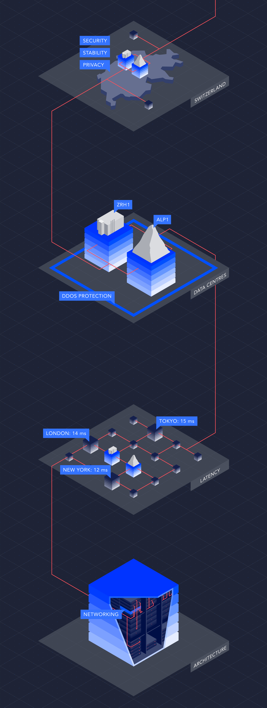
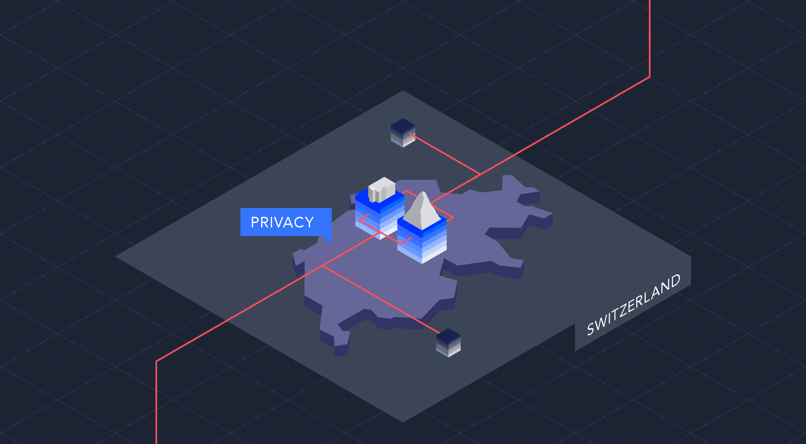
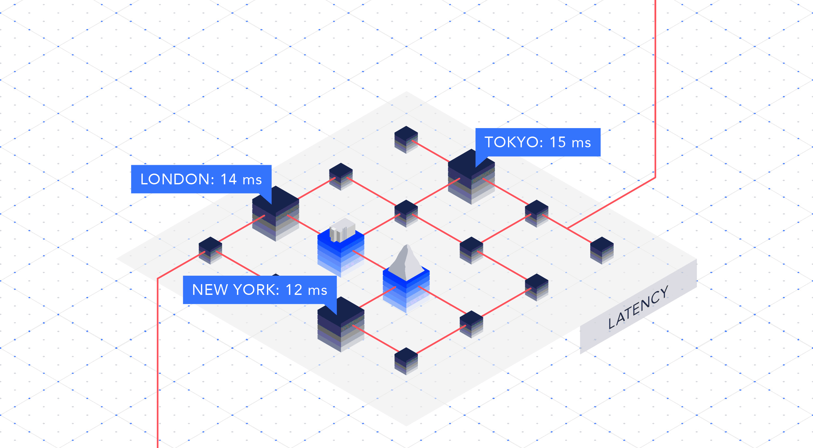
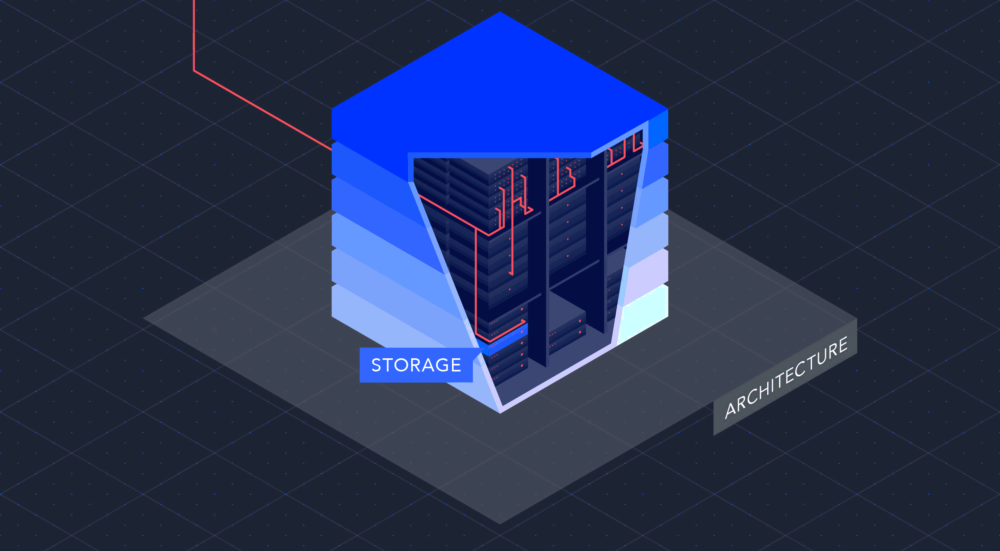

Innofield (today [flow.swiss](https://flow.swiss/)) offers premium cloud services and Swiss-based, enterprise-class infrastructure as a service. They turned to [superdot](https://www.superdot.studio/) to visualize what their product is all about and make it understandable to a wider audience.

The isometric visualization is structured in four parts, highlighting the four main features of the product.

Like a power cord, a red thread leads from one topic to the next.

Users can switch from dark to light theme.

Subtle, playful animations allow more details to be accommodated within the illustrations.

