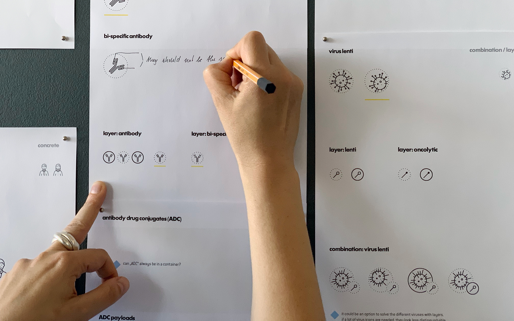

Lonza is a global leader in life sciences with about 15,500 employees in 120 locations around the world. Visual communication can easily get messy. This is problematic in many ways, especially since communication needs to show the internal willingness for transparency.

[Superdot](https://www.superdot.studio/) were commissioned to develop a sturdy icon system that is modular enough to accomodate the needs from large scale production to molecular biology, without violating the branding guidelines. There was a strong call for scientific accuracy, even in the miniature scale of an icon.

We elaborated a geometrical system based on the Lonza logo, with clear definitions for every angle, corner, line and point.

With these guidelines, the Lonza graphic department can also add further icons to their catalogue.

Each icon is pixel perfect, working on a scale as small as 48 × 48 pixels.

There is the option to add a 24 × 24 pixel layer icon to the bottom right. Like so, icons can convey more complex relationships.

Three categories of icons were identified: concrete, abstract and microscopic.

Since the change of scale from concrete to microscopic is visually challenging, we introduced the dotted circle as a metaphor for the view through a microscope.

