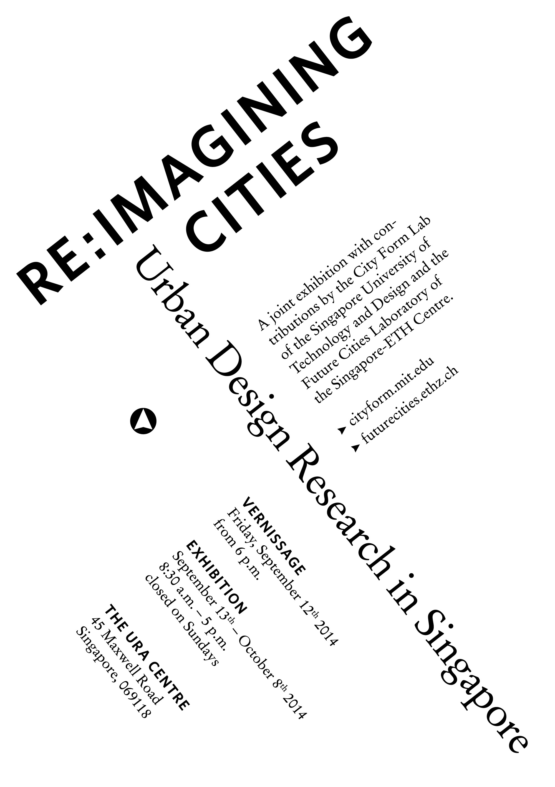
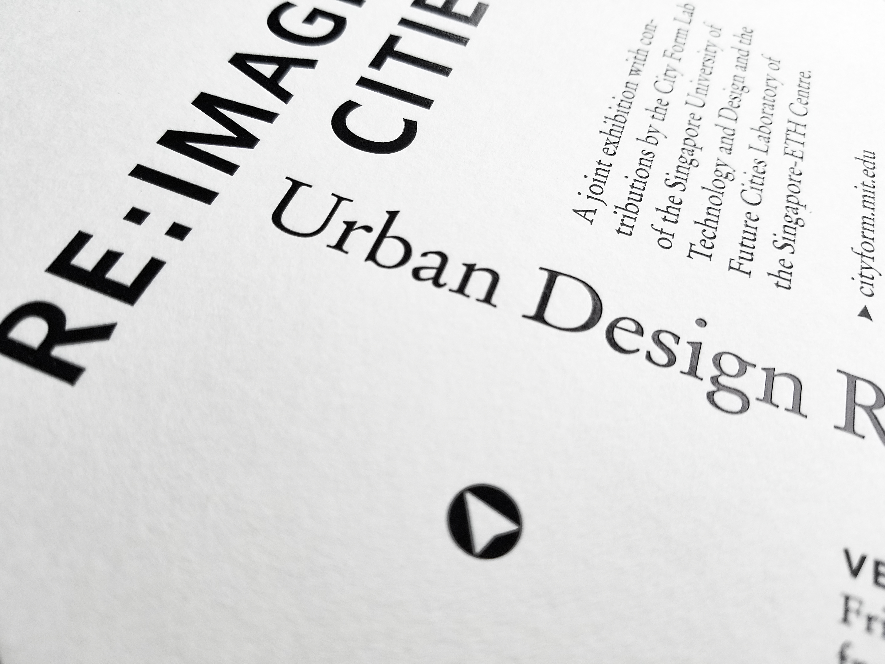
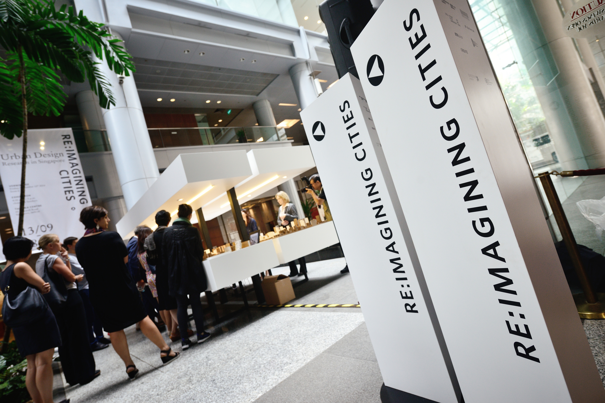
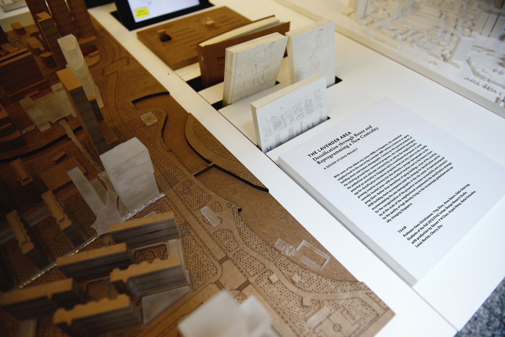
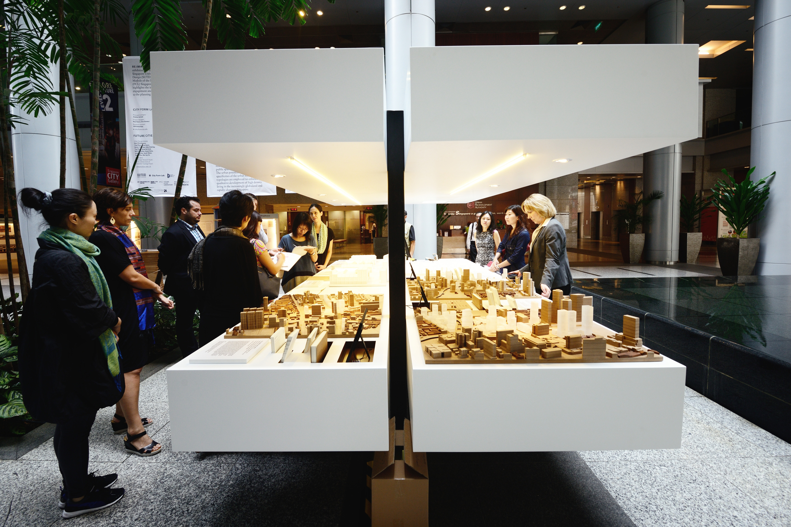
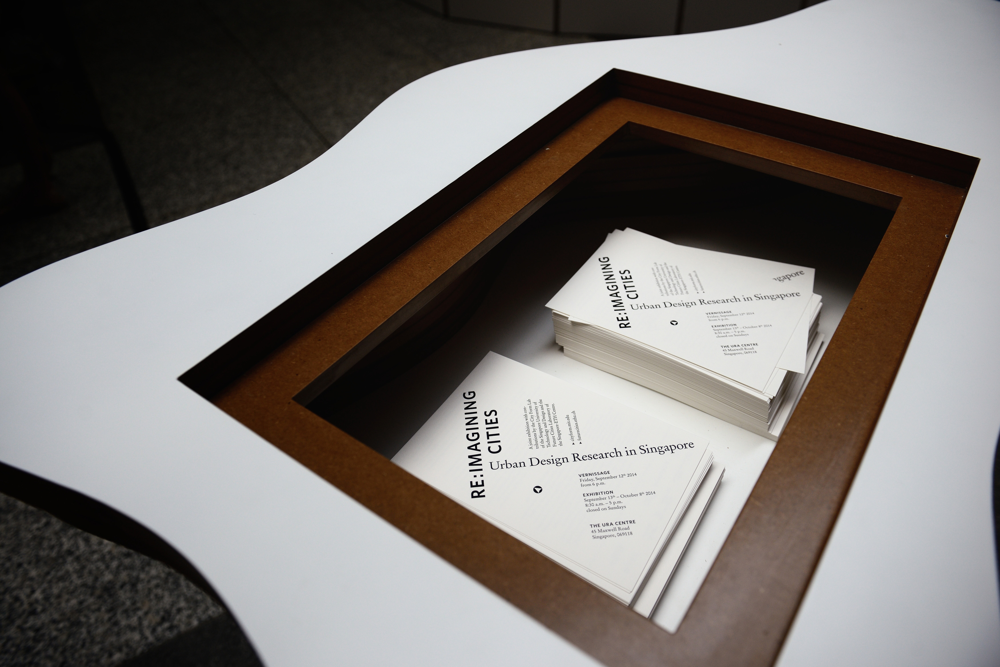
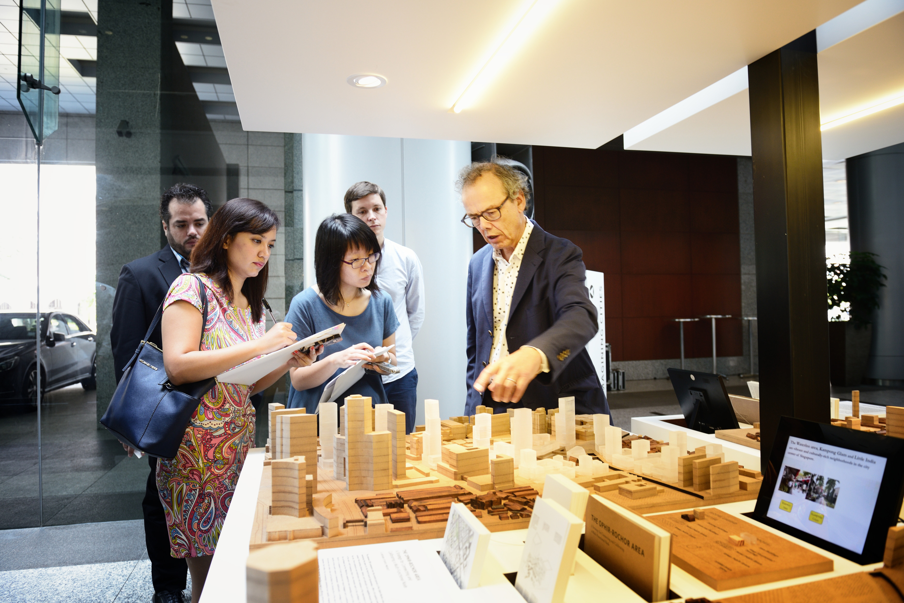
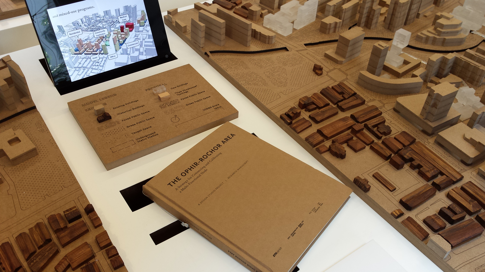
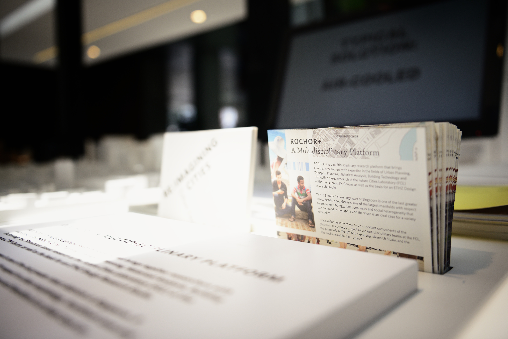
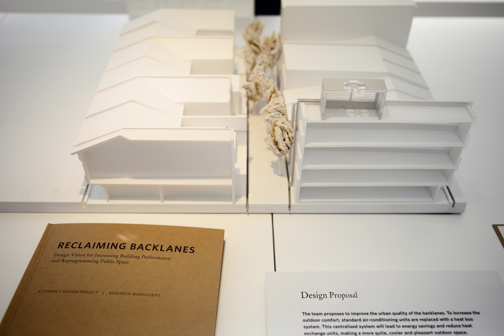

Two research institutes – [Future Cities Laboratory](https://fcl.ethz.ch/) (ETH) and [City Form Lab](http://cityform.mit.edu/) (SUTD) – presented their research findings on urban design at the URA Gallery in Singapore. I designed the visual identity for the exhibition, including the wayfinding system, flyers, invitation card, book covers and table labels.

The look and feel is clean and unobtrusive, with a lot of white space, black type and natural materials.

As a reference to the urban design context of the exhibition space – the building stands at a 38° angle to north – I used the same rotation for the text of the invitation card.

Photos by <a href="http://www.carlinateteris.com/">Carlina Teteris</a>

The invitation card was stamped in glossy black on off-white cardboard.

