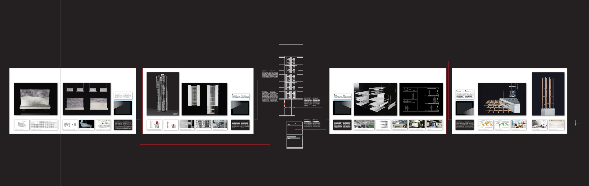
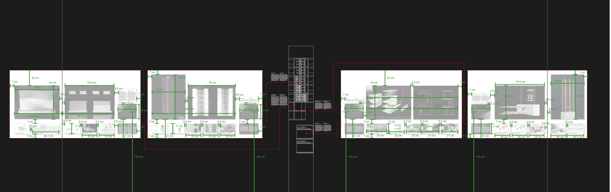
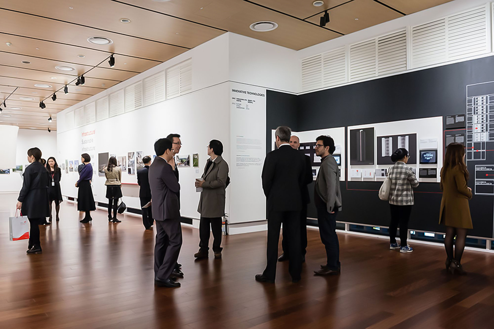
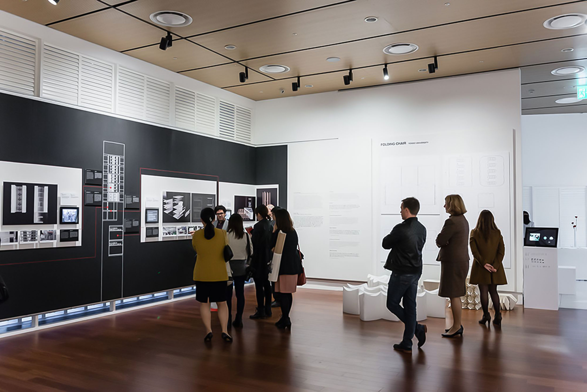
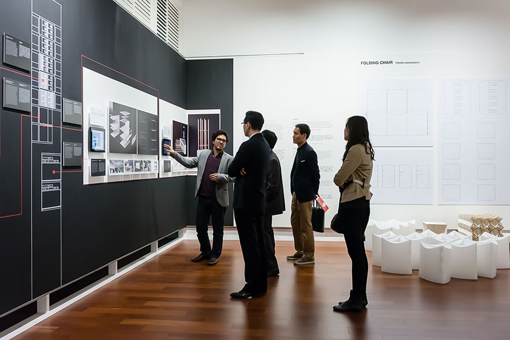
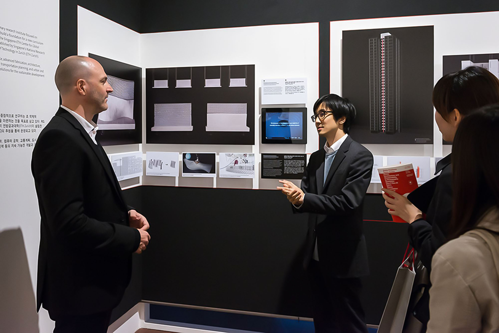

For the Swiss Positions + Swiss Scales Exhibition at the Korea Foundation Cultural Centre in Seoul, South Korea, researchers of the [Future Cities Laboratory](https://fcl.ethz.ch/) were invited to present their work on different aspects of innovative and sustainable technologies for buildings, including solutions for air conditioning, sustainable building materials and robotically fabricated concrete walls for material efficiency.

In close collaboration with the researchers, I designed the exhibition space and coordinated the production and assembly.

A stylized skyscraper marks the center of the space. Red threads lead from the researched part (of the building) to the four respective projects, which are displayed in white "windows". The building is laser cut on white and applied directly to the black wall. Each window displays two large, detailed images on photographic paper plus smaller, explanatory images, bi-lingual project descriptions in English and Korean, and a screen with short clips.

