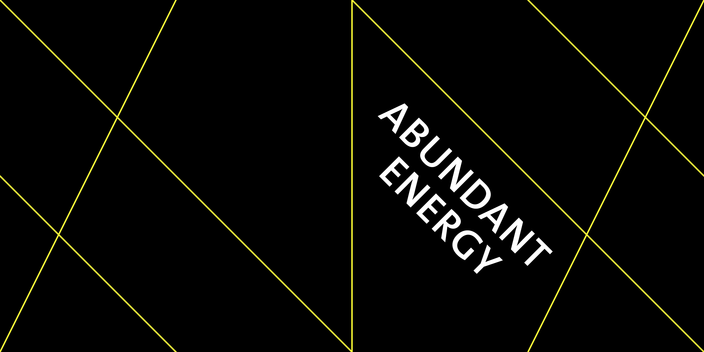

The Future Cities Laboratory led a forum at the World Cities Summit in Singapore to discuss and debate the '5 Propositions for Sustainable Future Cities.' I designed the invitation card plus five promotional postcards, one for each of the five lectures.

To make the cards work as a series, I developed a line system that visually segments each card individually, but follows certain parameters.

It is possible to place any card next to any other, in any direction, their lines always connect. Like this, they can be playfully put together to form a poster resembling a city grid at night.

