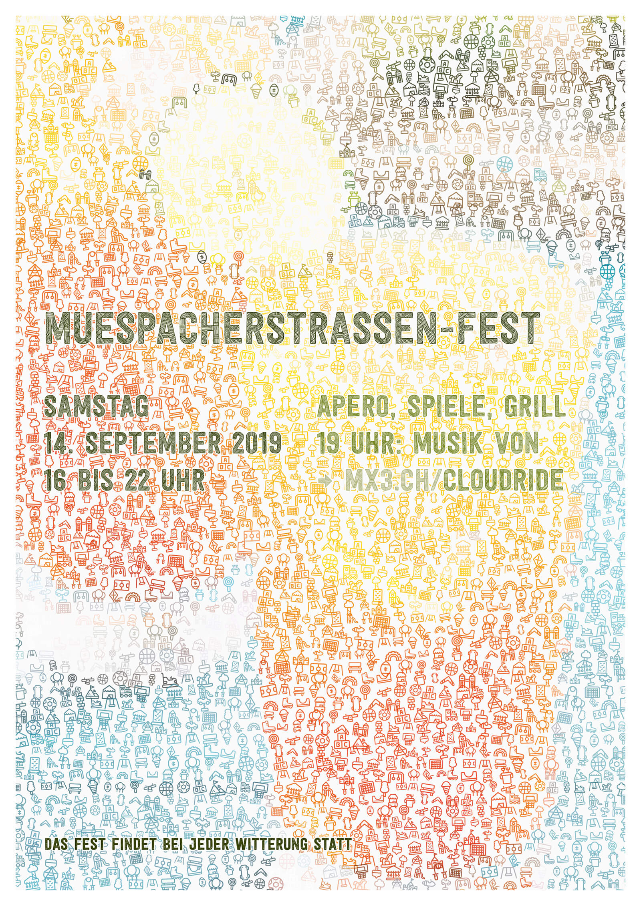

In 2011, I had the opportunity to move to Singapore with my family. Surrounded by an inspiring group of researchers, I started experimenting with generative design by coding in Processing and other languages.

I try to use code as a tool, just as I use pen and paper or Adobe Creative Suite. I've been able to make use of it in a number of projects, such as <a href="../CostOfLiving">Cost of Living</a> and <a href="../DataDrawing">Drawing with Data</a>. I also try to make time to write a few lines a day – you can discover some results browsing this website.

Generative Design is very powerful when it comes to serialized design. For the cards shown here, I started out with code from the book [Generative Design](http://generative-gestaltung.de) and adapted it so that I only need to adjust a few parameters to create new wedding cards and birthday invitations.

As a co-organiser of an annual street fair, and the person in charge of the PR department with a zero budget, I've found that generative design is very helpful to whip up posters and flyers in a jiffy.

I created an icon-based font that I use to render the posters, and paired it with a large display font. For the flyers, I use the same source image, but incorporate the text directly into the visuals.

